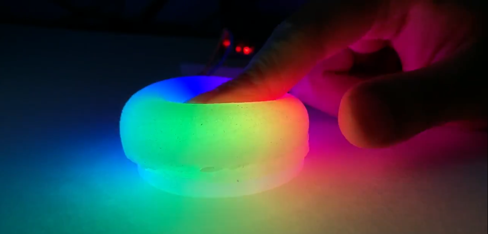

# Siloseam
### A Morphogenetic Workflow for the Design and Fabrication of Inflatable Silicone Bladders

This repository is the official implementation of the DIS2020 paper [Siloseam](TODO:LinkToACM).

## Authors
* [Hedieh Moradi](http://hybridatelier.uta.edu/members/103-hedieh-moradi)
* [Cesar Torres](http://hybridatelier.uta.edu/members/1-cesar-torres)

## Design Tool
* [Online Tool](https://hybridatelier.uta.edu/apps/siloseam)
* [Source Code](https://github.com/The-Hybrid-Atelier/siloseam/tree/master/tool)

## Characterization Files
* [Bladder Characterization Design Files](https://www.thingiverse.com/thing:4283808)

## Videos & Instructions

### Textured Squeeze Bladder
* Instructable A: [Making a Textured Squeeze Bladder](https://www.instructables.com/id/Silicone-Textured-Inflatable-Squeeze-Bulb/)
* Design Files: [Textured Squeeze Files](https://www.thingiverse.com/thing:4399272/files)

### Octopus
* Design Files: [Octopus](http://hybridatelier.uta.edu/projects/38-siloseam)
* Video: [Designing a Silicone Bladder](https://youtu.be/BlMqOIE3d1k)
* Video: [Fabbing a Silicone Bladder](https://youtu.be/CAZFEzSPMgg)

## Contributing
The material available through this repository is open-source under the MIT License. 
We welcome contributions of community-made designs! You can either submit a pull request via Github or send us a link to your Instructables, Thingiverse, or design files to hybrid.atelier.uta@gmail.com
